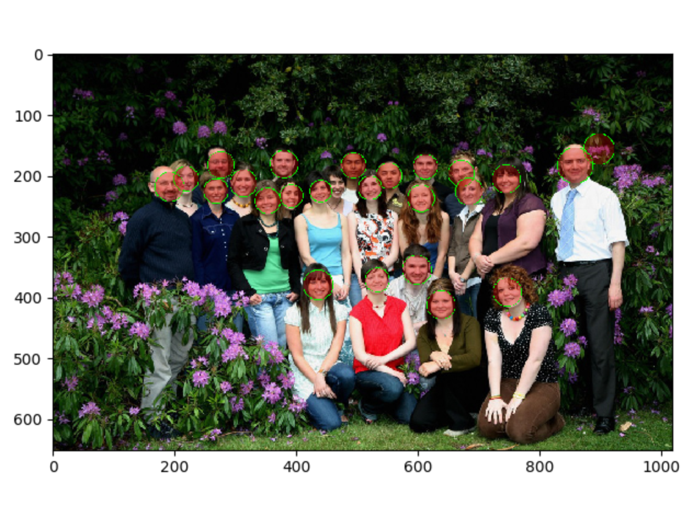

## Face recognition

The face recognition Demo is based on cv2 in OpenCV. For python language, please see the following files for the code!

File Description: The xml file in haarcascades is a trained classifier that comes with OpenCV, but it must be grayscale as input. By default, the CentOS system has a path to clf under /usr/share/OpenCV/haarcascades/, so I will copy it to this directory for convenience. This demo only uses two classifiers, one is face, one is mouth, if you need to test other, you want to change the clf parameter!

## Library Dependencies

First install the following dependencies under CentOS 6.5 to ensure that the relevant packages are not missing.

- numpy (use `yum install numpy` on yum in centos system)
- python-opencv* (use `yum install opencv*` with yum in centos system)
- PIL module (Use yum to install `yum install Pillow` in centos system)

Off topic, provide an article about installing pip, Python many modules are available for installation via pip: [Python learning - install pip and scikit-learn] (http://blog.csdn.net/dream_angel_z/article /details/45828189)

## Testing and Results

Run under CentOS: `python face_detect.py`, the relevant parameters can be specified in the main function.

Finally output ./*.face.jpg, ./*.mouth.jpg file, and *_faces directory (save the recognized face)!

